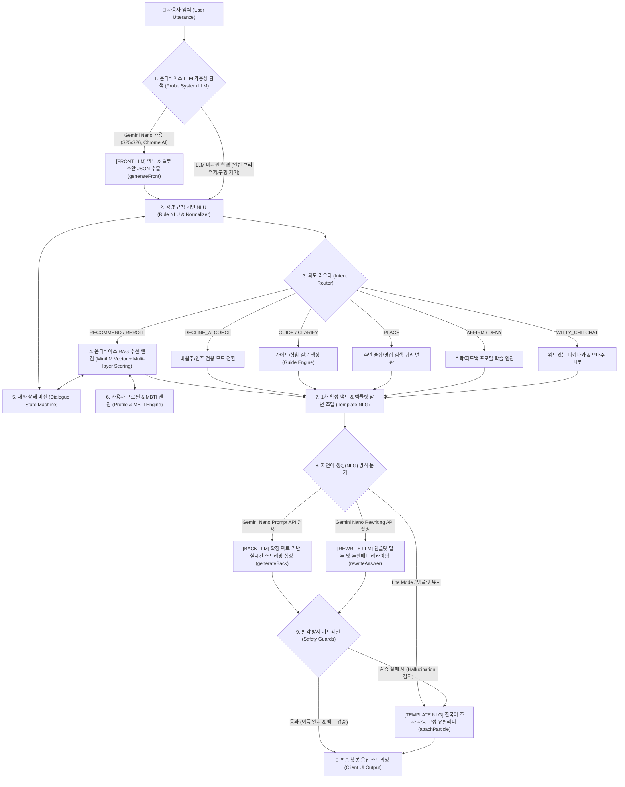

# 🍸 OMAJU AI 엔진 아키텍처 및 로직 구조 명세서

> **OMAJU(오마주)**는 서버 비용이나 외부 유료 API 의존 없이 브라우저 및 모바일 기기 내에서 온디바이스로 구동되는 **2단계 하이브리드 AI 바텐더 시스템(Hybrid On-Device AI Architecture)**입니다.  
> 기기 환경에 따라 **Gemini Nano(Android AICore / Chrome Built-in AI)**를 활용한 **Front/Back LLM 스트리밍**과, 미지원 환경에서도 100% 작동하는 **MiniLM ONNX 벡터 RAG + 규칙 기반 NLU + 상태 머신 템플릿 NLG**가 완벽하게 상호 보완하도록 설계되어 있습니다.

---

## 1. 2단계 하이브리드 파이프라인 아키텍처 (2-Tier Architecture)



---

## 2. 주요 모듈 및 서비스 구조

```
src/
├── services/
│   ├── aiService.js          # [코디네이터] System LLM(Probe, Front, Back)과 Web Worker 오케스트레이션
│   ├── frontGate.js          # 복잡한 발화에서만 Front LLM을 켜는 지능형 게이트
│   └── llm/                  # [온디바이스 LLM 인터페이스 레이어]
│       ├── getProvider.js    # 플랫폼별 LLM Provider 자동 선택 (Android AICore, iOS, Stub)
│       ├── androidProvider.js# Android AICore (Gemini Nano Prompt / Rewriting API) 플러그인 연동
│       ├── iosProvider.js    # iOS System LLM 연동
│       ├── onDeviceNlg.js    # 템플릿 전처리 및 환각 방지 가드레일 (rewriteKeepsNames 등)
│       ├── prompts.js        # Front JSON 추출 및 Back 스트리밍용 정밀 시스템 프롬프트
│       └── types.js          # FULL(LLM 가용) vs LITE(Worker 전용) 모드 정의
│
└── workers/                  # [온디바이스 백그라운드 엔진 레이어 (Web Worker)]
    ├── conversationTurn.js   # 한 턴의 파이프라인 총괄 오케스트레이션
    ├── aiWorker.js           # Worker 메시지 수신/응답 엔트리포인트
    ├── nlu/                  # 규칙 기반 NLU, 도메인 사전, 자모 분리, 1~4번 번호 분기, 16종 MBTI 포착
    ├── semantic/             # 대화 상태 머신, 턴 간 비음주/안주 전용/제약조건 상속
    ├── engines/              # MiniLM ONNX 벡터 임베딩, 다계층 스코어링, 프로필 학습, AnswerBuilder
    ├── chat/                 # 의도별 핸들러 (추천, 가이드, 장소, 위트 잡담, 수락 등)
    └── data/                 # 지식 베이스 (주류 152종, 안주 354종, 게임 30종, MBTI 16종)
```

---

## 3. Gemini Nano 온디바이스 LLM 2단계 활용 상세

### 🔹 1단계: FRONT LLM (온디바이스 의도 & 슬롯 선제 파싱)
* **역할**: 사용자의 자연어 발화가 복잡하거나 모호할 때, **Gemini Nano Prompt API**를 호출하여 JSON 스키마 형태의 의도 초안(`frontDraft`)을 선제 추출합니다.
* **프롬프트 (`prompts.js - buildFrontPrompt`)**:
  ```json
  {
    "intent": "RECOMMEND|GUIDE|MOOD|SMALLTALK|PLACE|DECLINE_ALCOHOL|...",
    "slots": {
      "alcoholHints": ["맥주", "소주"],
      "snackHints": ["치킨"],
      "moods": ["happy"],
      "constraints": { "onlySnack": false, "nonAlcoholic": false, "exclude": [] }
    },
    "confidence": 0.95
  }
  ```
* **교차 검증 (`validate.js`)**: LLM이 추출한 초안(`frontDraft`)과 로컬 규칙 기반 NLU 결과를 상호 비교하여 오탐을 방지하고 최상의 슬롯 정보를 확정합니다.

---

### 🔹 2단계: RAG 추천 엔진 (결정론적 팩트 확정)
* **원칙**: 추천할 술과 안주, 술게임은 **LLM이 임의로 지어내지 않고(Hallucination 원천 차단)**, 로컬 RAG 벡터 엔진과 페어링 알고리즘이 354종 안주 및 152종 주류 DB에서 수학적으로 최적의 콤보(`facts: { alcohol, snack, game, mbtiTrait }`)를 확정합니다.

---

### 🔹 3단계: BACK LLM & REWRITE LLM (자연어 스트리밍 & 폴리싱)
1. **Back LLM (Prompt API 스트리밍)**:
   - 확정된 팩트(`facts`)를 주입하여 Gemini Nano가 바텐더 페르소나로 1~3문장의 생동감 넘치고 자연스러운 추천 문장을 실시간 스트리밍(`onChunk`)으로 화면에 렌더링합니다.
2. **Rewrite LLM (Rewriting API 말투 다듬기)**:
   - Prompt API가 없는 기기(갤럭시 S25 등)에서는 1차 템플릿 답변의 톤앤매너를 부드럽고 매력적인 문체로 온디바이스 리라이팅합니다.
3. **환각 방지 가드레일 (`onDeviceNlg.js`)**:
   - `rewriteKeepsNames`: LLM이 생성한 문장에 RAG가 선정한 실제 술/안주 이름이 정확히 포함되어 있는지 검증.
   - `backAnswerLooksLikeSoftAsk`: 이미 추천이 확정되었는데 사용자에게 다시 되묻는 오류가 없는지 검증.
   - 가드레일을 통과하지 못하면 즉시 100% 검증된 로컬 템플릿 답변으로 자동 롤백됩니다.

---

## 4. LLM 미지원 환경에서의 온디바이스 Fallback (Lite Mode)

Gemini Nano / AICore가 없는 일반 웹 브라우저나 구형 스마트폰에서도 앱이 완벽하게 구동됩니다:

1. **Rule NLU**: 1~4번 안내 번호, 16종 MBTI, 50여 종 일상 잡담, 음주 거부 패턴을 100% 로컬 판별.
2. **MiniLM ONNX RAG**: 브라우저 WebAssembly/WebGPU를 활용해 384차원 임베딩 유사도 검색 수행.
3. **Template NLG & 조사 자동 교정**: 유니코드 종성 계산 유틸리티(`attachParticle`)를 통해 `을/를`, `과/와`, `은/는` 조사를 완벽하게 맞춤 조립하여 출력.

---

## 5. 데이터베이스 및 지식 베이스 규모

| 데이터 분류 | 파일 경로 | 규모 | 주요 특징 |
| :--- | :--- | :--- | :--- |
| **주류 (Alcohols)** | `src/data/alcohols.json` | **152종** | 소주, 맥주, 전통주, 와인, 위스키, 하이볼, 백주, 논알콜 등 상세 도수/가격대/태그 수록 |
| **안주 (Snacks)** | `src/data/snacks.json` | **354종** | 고기, 해산물, 탕/찌개, 전, 샐러드, 과일/디저트 등 매운맛/기름기/단맛 및 쉬운 홈레시피 수록 |
| **술자리 게임 (Games)** | `src/data/games.json` | **30종** | 인원수별, 난이도별, 벌칙 강도별 술자리 아이스브레이킹 게임 규칙 수록 |
| **MBTI 취향 지식 (MBTI)** | `src/data/mbtiTraits.js` | **16종** | 16가지 성향별 선호 분위기, 추천 주종/안주 편향, 추천 주량, 바텐더 맞춤 팁 수록 |
