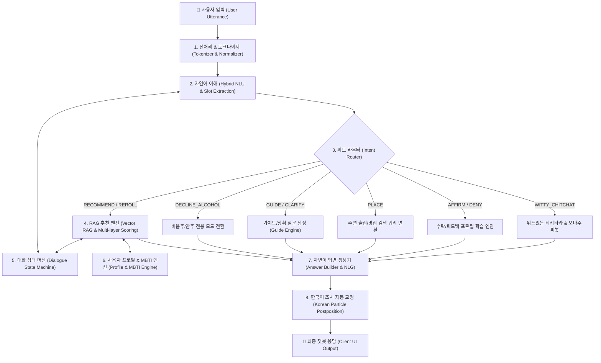

# 🍸 OMAJU AI 엔진 아키텍처 및 로직 구조 명세서

> **OMAJU(오마주)**는 서버 비용이나 외부 API 의존 없이 브라우저/디바이스 내에서 온디바이스로 구동되는 **경량 하이브리드 대화형 AI 바텐더 시스템**입니다.  
> 규칙 기반 자연어 이해(Rule-based NLU), MiniLM ONNX 벡터 임베딩 기반 검색(RAG), 다중 턴 상태 머신(Multi-turn State Machine), 맥락 인식형 자연어 생성(NLG)이 결합된 유기적인 파이프라인으로 구성되어 있습니다.

---

## 1. 전체 파이프라인 아키텍처 (End-to-End Pipeline)



---

## 2. 주요 모듈별 상세 로직 구조

```
src/workers/
├── conversationTurn.js       # [컨트롤러] 한 턴의 대화 파이프라인 총괄 오케스트레이션
├── ai.worker.js              # [워커] UI 스레드와 통신하는 Web Worker 엔트리포인트
├── nlu/                      # [자연어 이해 레이어]
│   ├── ruleNlu.js            # 규칙 기반 형태소/패턴/엔티티/의도 분류기
│   ├── domainLexicon.js      # 도메인 사전 (핵심 키워드, 이탈어, 긍/부정어 등)
│   ├── normalizeKorean.js    # 자모 분리, 오타 교정, 정규화 유틸
│   └── schema.js             # SemanticFrame 데이터 구조 정의
├── semantic/                 # [의미 및 대화 상태 레이어]
│   ├── dialogueState.js      # 턴 간 비음주/안주/무드/배제어 상태 누적 및 상속
│   ├── frame.js              # NLU Frame -> Semantic Frame 변환
│   └── glossary.js           # 용어 사전 매핑
├── engines/                  # [추천 및 평가 코어 엔진]
│   ├── recommendationEngine.js # RAG 벡터 검색 + 안주/주종 페어링 코어
│   ├── embeddingEngine.js    # MiniLM ONNX 모델 기반 온디바이스 텍스트 임베딩
│   ├── scoreEngine.js        # 다계층 스코어링 (L1 Vector + L2 Rule + L3 Profile)
│   ├── profileEngine.js      # 사용자 취향 학습 (선호도, 수락률, 거절률 갱신)
│   ├── stateMachine.js       # 대화 라이프사이클 상태 머신
│   └── answerBuilder.js      # 맥락 기반 템플릿 조립 & 자연어 생성기
├── chat/                     # [의도별 핸들러]
│   ├── router.js             # Intent별 핸들러 분기
│   ├── recommendation.js     # 추천 실행 및 컨텍스트 보강
│   ├── guide.js              # 가이드 및 유도 답변 처리
│   ├── wittyChitchat.js      # 50여 종 일상 대화/메타 질문 위트 응대
│   └── accept.js             # 사용자 수락 및 피드백 처리
└── data/                     # [도메인 지식 베이스]
    ├── alcohols.json         # 152종 주류 데이터베이스
    ├── snacks.json           # 354종 안주 및 레시피 데이터베이스
    ├── games.json            # 30종 술자리 게임 데이터베이스
    ├── mbtiTraits.js         # 16종 MBTI 성향별 주류/안주 편향 지식 베이스
    └── drinkFamilies.js      # 주종 패밀리 정규화 및 바이어스 정의
```

---

## 3. 핵심 파이프라인 단계별 동작 원리

### 1단계: NLU 및 의도 분류 (`ruleNlu.js`, `domainLexicon.js`)
* **단어 정규화**: 텍스트 클리닝, 자모 분리, 공백 제거 정규화.
* **의도(Intent) 판별 우선순위**:
  1. **안내 목록 번호 선택 (`1~4번`)**: `1번`(페어링 가이드), `2번`(무드별 가이드), `3번`(주변 장소 검색), `4번`(논알콜/간식 추천)
  2. **음주 거부/사양 (`DECLINE_ALCOHOL`)**: `"술 안마셔"`, `"오늘은 안마실래"`, `"금주"` 등 감지 시 억지 술 추천 차단.
  3. **MBTI 성향 인식**: 16가지 MBTI 코드(`INFP`, `ENFP`, `ESTJ` 등) 감지 시 성향 공감 인트로와 함께 MBTI 특화 추천 트리거.
  4. **수락 및 결정 (`AFFIRM`)**: `"좋아 그거 먹을래"`, `"콜"`, `"그걸로 할래"` 등 사용자 수락 감지.
  5. **단독 식재료/카테고리 힌트 포착**: `"과일?"`, `"치즈"`, `"해산물"`, `"국물"` 등 짧은 키워드를 안주 슬롯으로 즉시 매핑.
  6. **장소 검색 (`PLACE`)**: `"강남역 근처 술집"`, `"이자카야 찾아줘"` 등 지역명 + 업종 추출.

---

### 2단계: 다중 턴 대화 상태 머신 (`dialogueState.js`)
* 사용자의 이전 턴 맥락이 다음 턴으로 자연스럽게 계승됩니다.
* **비음주/안주 전용 상태 상속 (`nonAlcoholic`)**:
  - 1턴에서 `"술 안마셔"` 선언 ➔ 2턴에서 `"과일?"` 질문 ➔ 술(와인 등)이 다시 섞이지 않고 **과일 안주만 단독 추천**되도록 보장.
* **배제 제약어 누적 (`exclude`)**: `"치즈 말고"`, `"매운 거 빼고"` 등의 제외 조건이 세션 동안 누적 반영.

---

### 3단계: 온디바이스 RAG 추천 엔진 (`recommendationEngine.js`, `scoreEngine.js`)
1. **L1 벡터 유사도 (Vector Search)**:
   - 온디바이스 MiniLM ONNX 모델을 통해 사용자 입력 텍스트를 384차원 임베딩 벡터로 변환 후 코사인 유사도(Cosine Similarity) 계산.
2. **L2 룰 & 도메인 부스팅 (Rule Boosting)**:
   - 매운맛(`spicy`), 가벼움/다이어트(`light`), 고도수/독주(`heavy`), 해장/숙취(`hangover`) 제약조건에 따른 가감점 부여.
3. **L3 프로필 & MBTI 편향 (Profile Bias)**:
   - 사용자의 마이페이지 설정(선호 주종, 주량) 및 MBTI 성향(`drinkBias`, `snackBias`)에 따른 정밀 가중치 부여.
4. **페어링 매트릭스 검증**:
   - 선정된 주종과 궁합이 검증된 안주(`bestDrinks` 상호 참조)를 최종 콤보로 선출.

---

### 4단계: 맥락 인식형 답변 생성 및 한국어 조사 처리 (`answerBuilder.js`)
* **프로필 일치 여부에 따른 동적 연결 멘트**:
  - **선호 주종 일치 시 (`소주` ➔ `참이슬`)**:
    - `"(평소 소주를 좋아하시는 취향에 딱 맞게 골라봤어요! ✨)"`
  - **선호 주종과 다른 추천 시 (`소주` ➔ `스파클링와인`)**:
    - `"(평소 소주를 즐겨 드시지만, 오늘은 분위기 전환 겸 색다르게 스파클링와인과 함께해 보세요! 🌟)"`
* **한국어 음절 종성 계산 기반 자동 조사 부착**:
  - 유니코드 음절 계산(`(charCode - 0xAC00) % 28`)을 통해 괄호 표기 `을(를)` 대신 `소주를` / `와인을`, `소주와` / `와인과`, `소주는` / `와인은`을 문법에 맞게 자동 완성.

---

## 4. 데이터베이스 및 지식 베이스 규모

| 데이터 분류 | 파일 경로 | 규모 | 주요 특징 |
| :--- | :--- | :--- | :--- |
| **주류 (Alcohols)** | `src/data/alcohols.json` | **152종** | 소주, 맥주, 전통주, 와인, 위스키, 하이볼, 백주, 논알콜 등 상세 도수/가격대/태그 수록 |
| **안주 (Snacks)** | `src/data/snacks.json` | **354종** | 고기, 해산물, 탕/찌개, 전, 샐러드, 과일/디저트 등 매운맛/기름기/단맛 및 쉬운 홈레시피 수록 |
| **술자리 게임 (Games)** | `src/data/games.json` | **30종** | 인원수별, 난이도별, 벌칙 강도별 술자리 아이스브레이킹 게임 규칙 수록 |
| **MBTI 취향 지식 (MBTI)** | `src/data/mbtiTraits.js` | **16종** | 16가지 성향별 선호 분위기, 추천 주종/안주 편향, 추천 주량, 바텐더 맞춤 팁 수록 |

---

## 5. 대표적인 다중 턴 대화 처리 시나리오 예시

```text
[Turn 1] 사용자: "술 안마셔"
  └─ [NLU] Intent: DECLINE_ALCOHOL
  └─ [상태] nonAlcoholic = true, onlySnack = true 저장
  └─ [응답] "건강 챙기며 쉬어가는 센스, 최고예요! 👏 무알콜 꿀조합이 필요하시면 말씀해 주세요."

[Turn 2] 사용자: "과일?"
  └─ [NLU] Intent: RECOMMEND, Slot: 과일 (snack)
  └─ [상태] 이전 턴 nonAlcoholic 상속 -> 주류 추천 자동 배제
  └─ [응답] "오늘은 안주파 모드로 가시죠! 🍽️ **과일화채** 어떠세요? 인기 매력에 푹 빠지실걸요?"

[Turn 3] 사용자: "4번"
  └─ [NLU] 목록 번호 4번 인식 -> 논알콜 & 힐링 간식 단독 추천
  └─ [응답] "제가 바텐더지만, 가끔은 안주만 추천하는 것도 재밌네요! 😆 오늘은 **오리주물럭**으로 힐링해 보세요."

[Turn 4] 사용자: "좋아 그걸로 할래"
  └─ [NLU] Intent: AFFIRM (수락)
  └─ [학습] 오리주물럭 선호도 및 추천 수락률(acceptanceRate) 갱신
  └─ [응답] "좋은 선택이에요. 이 조합, 기억해 둘게요! (오리주물럭)"
```
