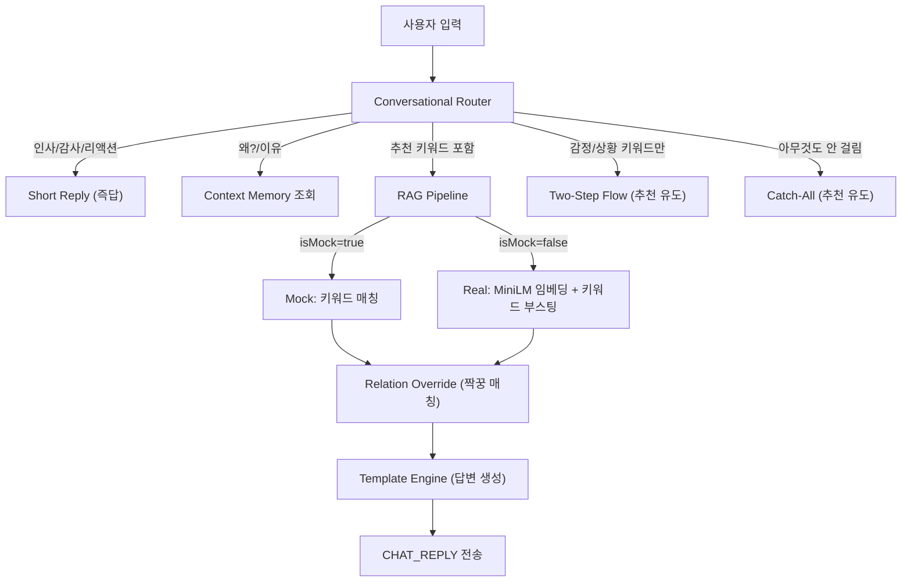

# 오마주 AI 챗봇 구조 정밀 분석 리포트

## 현재 아키텍처 개요



---

## ✅ 잘 설계된 부분

| 항목 | 설명 |
|------|------|
| **Dual-Mode RAG** | 모델 로드 실패 시 `isMock=true`로 자동 전환, 무중단 서비스 보장 |
| **Conversational Router** | 인사/감사/리롤/호출/리액션 등 패턴별 분기가 명확 |
| **Two-Step Flow** | 감정/상황만 감지되면 즉시 추천하지 않고 "추천해 드릴까요?" 먼저 질문 |
| **Context Memory** | `lastRecommendation` + `lastReason`으로 "왜?" 팔로업 질문 대응 |
| **Relation Override** | 안주만 매칭됐을 때 `bestDrinks`에서 술을 찾는 짝꿍 로직 |
| **Profile Learning** | 좋아/싫어 표현에서 자동으로 취향 학습 |
| **Static Import** | JSON 데이터를 `import`로 번들링하여 프로덕션 빌드에서도 안전 |
| **Template Variety** | 각 카테고리마다 5~7개의 다양한 응답 템플릿 |

---

## 🔴 심각한 문제점 (Critical)

### 1. `sashimi`의 bestDrinks에 존재하지 않는 ID 참조
```
snk_sashimi -> ["alc_soju_cham", "alc_chungha", "alc_wine_white"]
```
- `alc_chungha`(청하)와 `alc_wine_white`(화이트 와인)는 **alcohols.json에 존재하지 않습니다**
- `pickRandom(bestDrinks)` → `alcohols.find(a => a.id === drinkId)` → **`undefined`** 반환
- 결과: "회 먹고 싶다" 입력 시 33% 확률로 **술 추천이 비어버림** (null fallback)

### 2. Mock 모드에서 `wantOnlySnack`, `wantOnlyAlc`, `wantNonAlc` 필터 미적용
- Real RAG에서는 `wantOnlySnack` → 주류 검색 건너뛰기, `wantNonAlc` → 논알콜만 검색 등이 적용됨
- **Mock 모드에서는 이 필터들이 전혀 무시됨** → "술 말고 안주만" 해도 술이 추천됨

### 3. `relations.json`의 커버리지 부족 (11개 관계 / 112개 가능 조합)
- 주류 8 × 안주 14 = 112가지 조합 가능
- 실제 등록된 관계: **11개 (9.8%)**
- Real RAG의 Knowledge Graph 부스팅이 대부분의 경우 작동 안 함

---

## 🟡 개선 필요 사항 (Major)

### 4. 대화 히스토리 부재
- 현재 `lastRecommendation` 하나만 저장 → **단 1턴 전**의 추천만 기억
- "아까 추천해준 거 뭐였어?", "처음에 말한 거" 등 멀티턴 대화 불가
- 대화가 길어지면 문맥을 전혀 활용하지 못함

### 5. 감정/상황 → 주류/안주 연결 로직 부재
- `emotionsData`와 `situationsData`는 **오프닝 문구 생성에만 사용**
- "비 오는 날" 감지 → 파전+막걸리 같은 **상황 기반 페어링 로직이 없음**
- 날씨 데이터가 `alcohols.json`과 `snacks.json`에 `weather` 필드로 있지만 **RAG에서 활용 안 됨**

### 6. Mock 모드의 단일 글자 토큰 무시
```javascript
if (t.length < 2) continue; // "회", "빵" 등 1글자 음식명 무시
```
- Real RAG에는 `['비', '눈', '회', '파', '단', '짠', '맵', '쓴']` 예외 처리가 있지만
- **Mock 모드에는 이 예외 처리가 없어서** "회 먹고 싶다" → 매칭 실패

### 7. 게임 추천이 거의 노출 안 됨
```javascript
if (bestGame && (currentText.includes('게임') || currentText.includes('놀') || ...))
```
- 사용자가 **명시적으로 "게임"이라고 말해야만** 추천됨
- 회식/파티/엠티 상황에서도 자동으로 게임을 함께 추천하지 않음

### 8. 답변 구조의 단조로움
- 현재 구조: `[오프닝] + [추천 문장]` → 항상 2파트
- 구체적 정보(도수, 가격대, 추천 이유) 누락
- 카드형 UI 응답(이미지, 버튼 등) 미지원 → 순수 텍스트만

---

## 🟢 경미한 개선 사항 (Minor)

### 9. `bestAlc && bestSnack` 모두 null일 때의 응답이 단일
- 현재: `"음... 원하시는 취향을 조금 더 자세히 말씀해주시면..."` 하나만 있음
- 다양한 유도 질문이 필요

### 10. 프로필 업데이트에서 중복 방지 미비
- `userProfile.favoriteFoods.push('spicy')` → 매번 추가되어 배열이 무한히 길어질 수 있음
- `favoriteAlcohols`에는 중복 체크 있지만 `spicy` 같은 특수값에는 없음

### 11. Catch-All 응답과 짧은 리액션 응답의 혼동
- "ㅎㅎ", "ㅋㅋ" → 짧은 리액션으로 분류되지만
- 그 다음 어떤 말을 해도 `chatState`가 `IDLE`이므로 다시 Catch-All로 빠짐
- 연속 리액션 후 자연스러운 흐름 연결 불가

---

## 📋 권장 수정 우선순위

| 순위 | 항목 | 난이도 | 영향도 |
|:----:|------|:------:|:------:|
| 1 | `sashimi`의 깨진 bestDrinks ID 수정 + 누락 주류 추가 | ⭐ | 🔴 |
| 2 | Mock 모드에 `wantOnlySnack`/`wantNonAlc` 필터 적용 | ⭐⭐ | 🔴 |
| 3 | Mock 모드 단일 글자 토큰 예외 처리 추가 | ⭐ | 🟡 |
| 4 | 감정/상황 → `weather`/`moods` 필드 활용한 페어링 부스팅 | ⭐⭐ | 🟡 |
| 5 | 회식/파티 상황에서 게임 자동 추천 | ⭐ | 🟡 |
| 6 | `relations.json` 확장 (최소 주요 조합 30개) | ⭐⭐ | 🟡 |
| 7 | 대화 히스토리 배열 도입 (최근 5턴) | ⭐⭐⭐ | 🟡 |
| 8 | 답변에 도수/가격대 등 구체적 정보 포함 | ⭐⭐ | 🟢 |
| 9 | 프로필 중복 방지 / spicy 중복 | ⭐ | 🟢 |

---

> [!IMPORTANT]
> 가장 시급한 것은 **1번(깨진 ID 참조)**입니다. 사용자가 "회" 관련 입력을 하면 33% 확률로 술 추천이 빠지는 치명적 버그입니다.
> 그 다음은 **2번(Mock 필터 누락)**으로, "술 말고 안주만 추천해줘" 같은 명시적 요청이 Mock 모드에서 완전히 무시됩니다.

